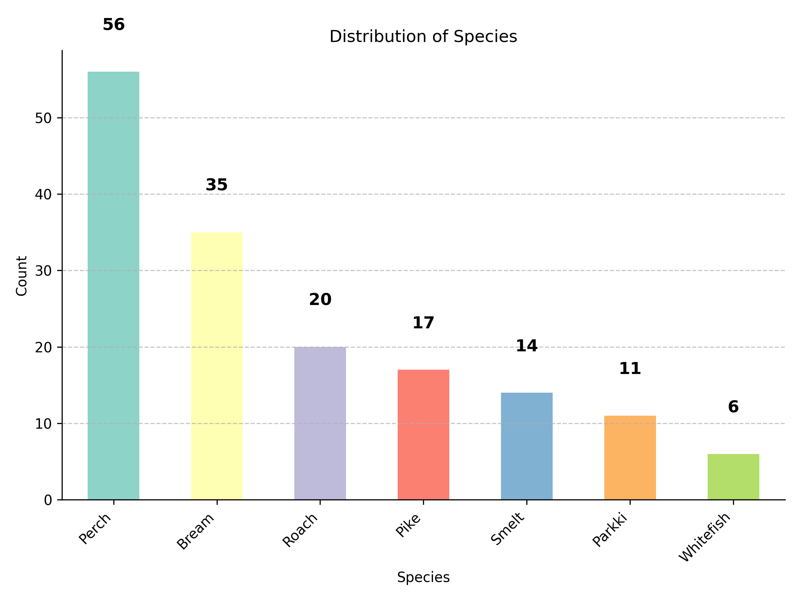
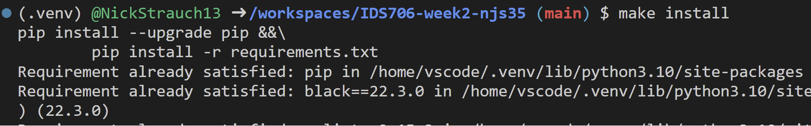
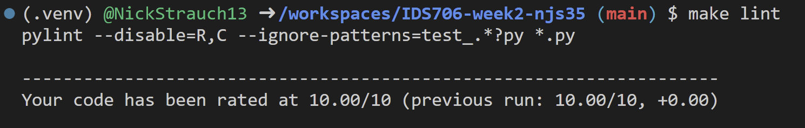
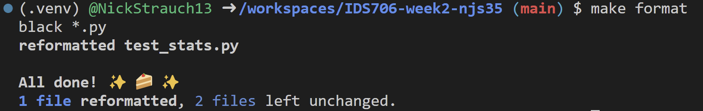
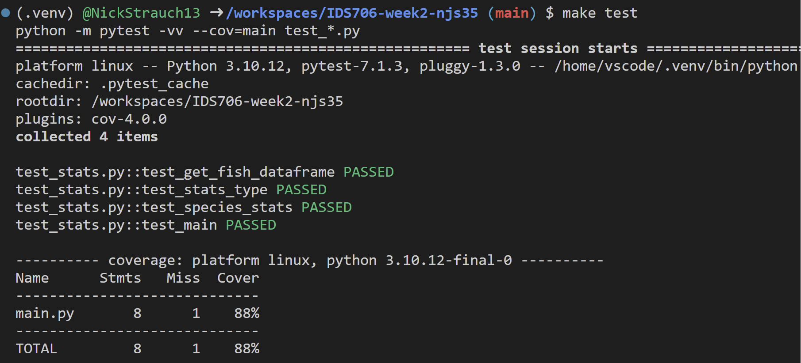

# Week 2 Mini-Project

### Pandas Descriptive Statistics

This project builds upon the GitHub template created in Week 1. The Pandas library is leveraged to generate descriptive statistics for a fish csv dataset [(Fish Dataset)](https://github.com/rickiepark/hg-mldl/raw/master/fish.csv).

### Fish Species Counts in CSV

### Makefile Pass results
- `make install`

- `make lint`

- `make format`

- `make test`
